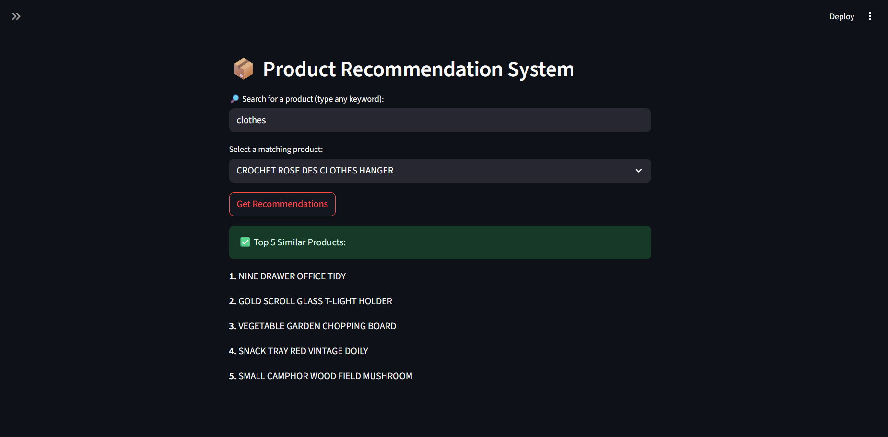

# 🛒 Shopper Spectrum – E-Commerce AI Dashboard

Welcome to **Shopper Spectrum**, an AI-powered Streamlit dashboard that brings together **Product Recommendations** and **Customer Segmentation** for e-commerce businesses. This project helps retailers deliver **personalized customer experiences** and optimize their marketing strategies through data-driven insights.

---

## 📌 Features

### 1️⃣ Product Recommendation System
- Collaborative Filtering using item-to-item similarity.
- Input any product name to get **top 5 similar product suggestions**.
- Real-time filtering of product names.
- Great for **cross-selling** and **enhancing product discovery**.

### 2️⃣ Customer Segmentation Predictor
- Predicts customer cluster based on **Recency**, **Frequency**, and **Monetary** values.
- Uses **RFM analysis + KMeans clustering**.
- Segments include: `High-Value`, `Loyal`, `Regular`, `At-Risk`.
- Helps optimize **customer retention** and **targeted marketing**.

---

---

## 🖼️ Screenshots

### 📌 Product Recommendation System


### 📌 Customer Segmentation Predictor


---

## 🧪 Tech Stack

- 🐍 Python 3.10+
- 📊 Pandas, Scikit-learn, Joblib
- 🎯 Streamlit (App UI)
- 📦 Pickle/Joblib for model serialization
- 📁 Google Drive (optional for dataset/model storage)

---

## ⚙️ Setup Instructions

### 1. Clone the Repository
```bash
git clone https://github.com/your-username/shopper-spectrum.git
cd shopper-spectrum
